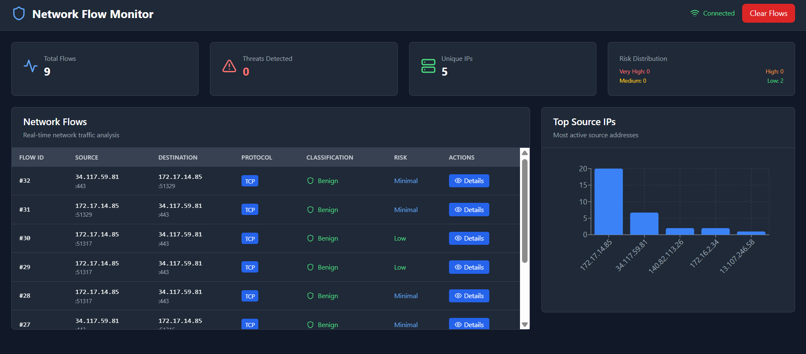
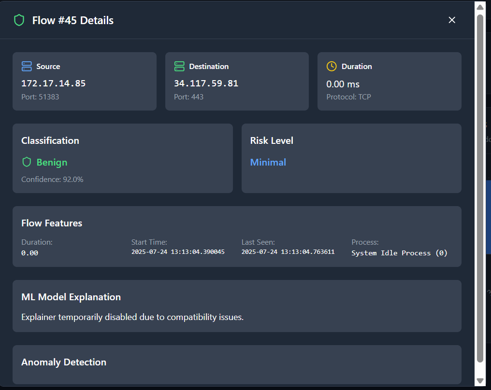
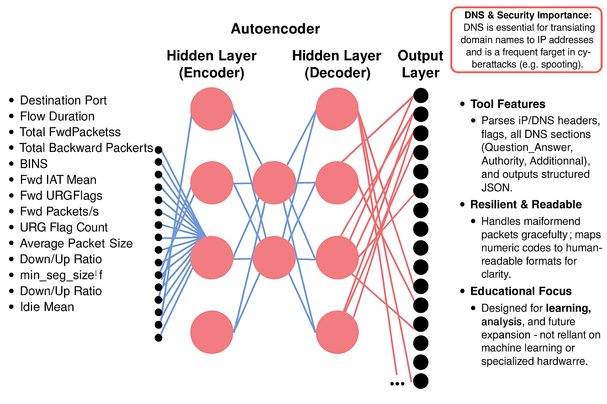
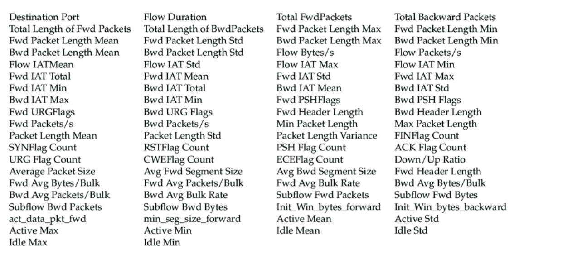
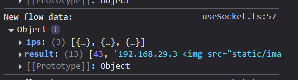
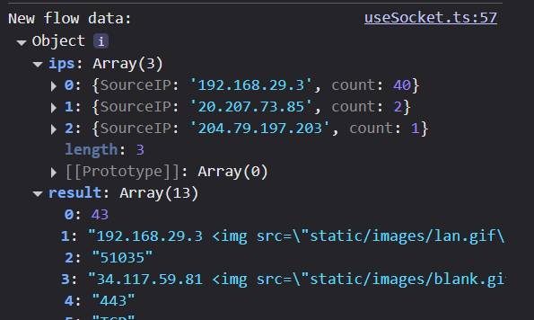
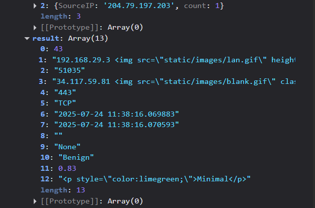

# Network Intrusion Detection System

This project is a web-based network intrusion detection system (NIDS) that captures and analyzes network traffic in real-time. It uses a machine learning model to classify network flows as either benign or malicious and provides a web interface to visualize the results.

## Screenshots

| Screenshot | Description |
| --- | --- |
|  | The main dashboard of the web application, which displays a summary of network traffic and security events. |
|  | The detailed analysis of a single network flow, including its classification, risk level, and features. |
|  | The architecture of the autoencoder model used for anomaly detection. |
|  | The features used to train the machine learning model. |
|  | The console output of the backend application, displaying real-time network flow data. |
|  | The console output of the backend application, displaying real-time network flow data. |
|  | The console output of the backend application, displaying real-time network flow data. |

## Features

- Real-time network traffic capture and analysis
- Machine learning-based classification of network flows
- Web-based dashboard to visualize network traffic and security events
- Detailed analysis of individual network flows
- Explanations of classification results using LIME

## Architecture

The project is divided into two main components:

- **Backend**: A Flask application that captures network traffic using Scapy, processes it into network flows, and uses a pre-trained machine learning model to classify the flows. The backend serves a REST API to provide the classification results to the frontend and uses Socket.IO to stream real-time updates.
- **Frontend**: A React application that provides a web-based dashboard to visualize the network traffic and security events. The frontend communicates with the backend using a REST API and Socket.IO.

## Installation

### Prerequisites

- Python 3.9 or later
- Node.js 14 or later

### Backend

1.  Navigate to the `backend` directory:
    ```bash
    cd backend
    ```
2.  Install the required Python packages:
    ```bash
    pip install -r requirements.txt
    ```

### Frontend

1.  Navigate to the `frontend` directory:
    ```bash
    cd frontend
    ```
2.  Install the required Node.js packages:
    ```bash
    npm install
    ```

## Usage

1.  Start the backend server:
    ```bash
    cd backend
    python application.py
    ```
2.  Start the frontend development server:
    ```bash
    cd frontend
    npm run dev
    ```
3.  Open a web browser and navigate to `http://localhost:5173` to view the dashboard.

## Project Structure

```
.
├── backend
│   ├── application.py
│   ├── flow
│   │   ├── Flow.py
│   │   ├── FlowFeature.py
│   │   └── PacketInfo.py
│   ├── models
│   │   ├── autoencoder_39ft.hdf5
│   │   ├── explainer
│   │   ├── model.pkl
│   │   ├── preprocess_pipeline_AE_39ft.save
│   │   └── scaler.pkl
│   ├── static
│   │   ├── css
│   │   ├── images
│   │   └── js
│   ├── templates
│   │   ├── detail.html
│   │   └── index.html
│   ├── .gitignore
│   ├── README.md
│   └── requirements.txt
├── frontend
│   ├── public
│   ├── src
│   │   ├── components
│   │   │   ├── Dashboard.tsx
│   │   │   ├── FlowDetailModal.tsx
│   │   │   ├── FlowTable.tsx
│   │   │   ├── IPStatsChart.tsx
│   │   │   └── StatusIndicator.tsx
│   │   ├── hooks
│   │   │   └── useSocket.ts
│   │   └── types
│   │       └── index.ts
│   ├── .env.example
│   ├── .gitignore
│   ├── index.html
│   ├── package.json
│   ├── postcss.config.js
│   ├── tailwind.config.js
│   ├── tsconfig.json
│   └── vite.config.ts
└── README.md
```